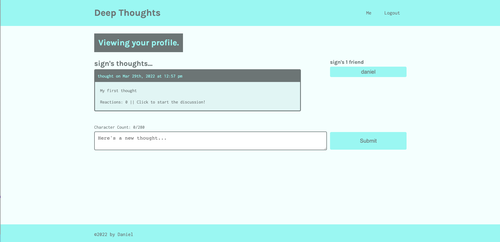

# Deep Thoughts

## Description

A social media application built using the MERN stack. The app, named Deep Thoughts, will allow users to sign up and create an account, post their thoughts, and interact with other users. It uses GraphQL, implemented by Apollo, in addition to Express server, and authentication using JWT's (JsonWebToken).

## Screen Shot

## Usage

In order to use this, you will need Node.js and MongoDB installed

Make sure your local mongo database connection is up and running then go to the root directory and open up the terminal, then type `npm install` to install, this will install **concurrently** then it install the dependencies in the package.json files in both the client and the server folders. Lastly type the code `npm run develop` to start the servers

_You can type `npm run seed` in order to seed the database with information_

Your default web browser should open on its own but if it doesn't, open up the browser of your choice and type `localhost:3000` as the url, this will be where the application is running

When the page loads you will see a list of all of the thoughts made by each user (_if there are any_) as well as the number of reactions to that thought, if you click on reactions then it will take you to the discussion page where all reactions by different users to this thought will be displayed. If you click on the name of the user who posted the thought then it will take you to their profile where you can see all of the thoughts that they have posted as well as their friends list.

You need to be logged in to be able to actually leave a thought or a comment though.

So, start by clicking on the sign up button and create an account (_or log in if you've already created an account_), then you can either click on "me" which you will see in the navbar to see your own profile and you can create a thought there and it will be posted to both the main page as well as your own profile or you can create the post in the main page itself

If you go another users profile by clicking on their name, you will see a button that will let you add them as a friend, once you do, go back to your own profile and you will see them show up on the right side under your friends list

If you'd like to play with the api, you can go to `localhost:3001/graphql` and try it out from there

_As a request by someone to explain the process because they were having a hard time understanding graphql and apollo, I went through most of the code starting from server/server.js and left detailed comments about what everything does, which you would not usually do, so think of this as a bonus!_

## License

This application is not covered under any license

## Technologies

The technologies used were, React, Apollo, GraphQL, Node.js, HTML, CSS, Javascript

## Contributions

By Daniel Arzanipour

## Questions

[My Github](https://github.com/DanielArzani)

If you need to reach me for any additional questions, you can reach me at my [Gmail](mailto:daniel.arzanipour@gmail.com)
